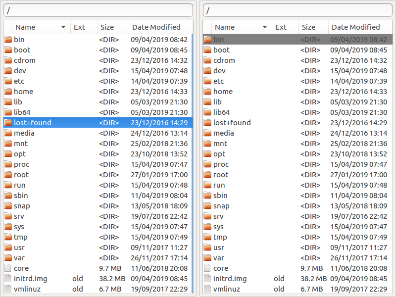

# NuCommander

NuCommander aims to be a fast, small orthodox file manager for Linux
with an emphasis on a keyboard driven user interface.

## Design

The twin pane interface, of Norton Commander, is preserved however all
redundant UI elements, such as command buttons and toolbars are
removed in favour of a clean, minimal user interface.

### Features

NuCommander has the basic features expected in an orthodox file
manager:

   * **Browsing Directories** - Both regular directories and archives.
   * **Basic Commands** - File copying, moving, renaming and deleting.
   * **Opening Files** - In their default applications.
   * **Archive Plugin Interface** - For creating plugins to read new archive types.

## Status

Releases of NuCommander are available however it is still at
alpha-level thus it may contain bugs and some important features are
yet to be implemented.
