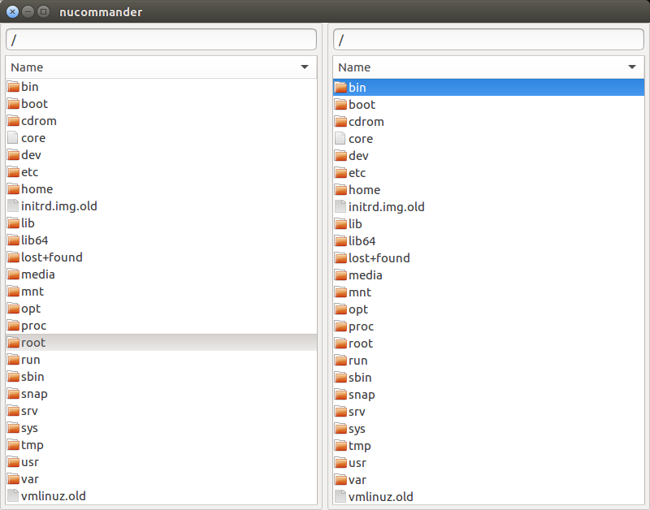

# NuCommander

NuCommander aims to be a fast, small, lightweight orthodox file
manager for Linux with an emphasis on a keyboard driven user
interface.

## Design

The twin pane interface, of Norton Commander, is preserved however all
redundant UI elements, such as command buttons and toolbars are
removed in favour of a clean, minimal user interface.

## Status

NuCommander is currently in early stages of development.

The following basic features have been implemented, __there is still
significant polishing up to do__:

   * *Browsing Directories* - both regular directories and archives.
   * *Opening files* in their default applications.
   * *File Copying* - both to and from regular directories and archives.
   * *Archive plugin interface* - for creating plugins to read various archive types
