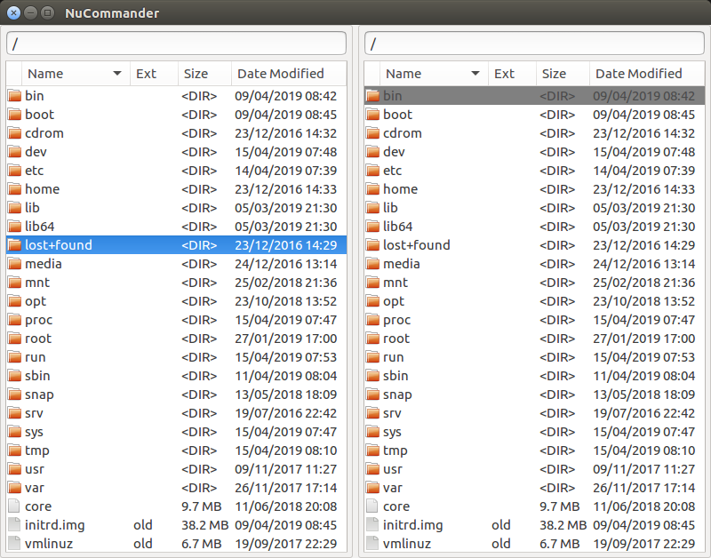
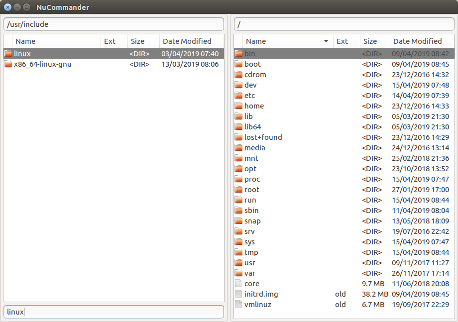
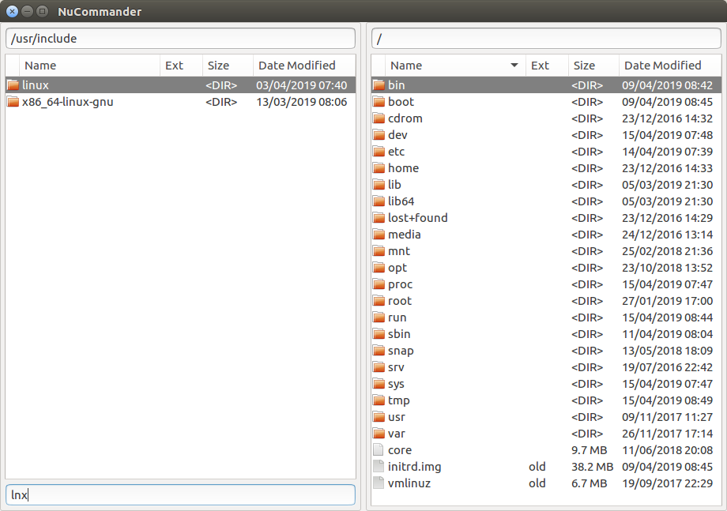
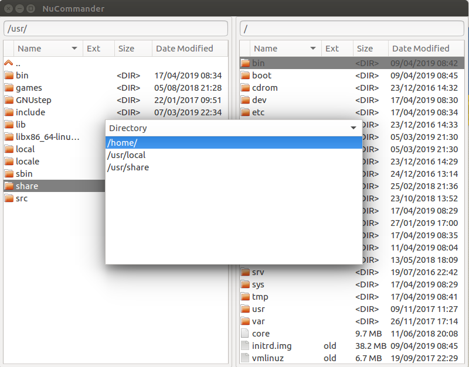

# NuCommander

NuCommander aims to be a fast, small orthodox file manager for Linux
with an emphasis on a keyboard driven user interface.

## Design

The twin pane interface, of Norton Commander, is preserved however all
redundant UI elements, such as command buttons and toolbars are
removed in favour of a clean, minimal user interface.

## Features

NuCommander has the basic features expected in an orthodox file
manager:

   * **Browsing Directories** - Both regular directories and archives.
   * **Basic Commands** - File copying, moving, renaming and deleting.
   * **Opening Files** - In their default applications.
   * **Archive Plugin Interface** - For creating plugins to read new archive types.

### Fuzzy Filtering

The file listing can be filtered using a fuzzy search. This allows you
to display only files which match a particular search string, whether
the search string matches in the beginning or the middle of the file
name. For example the search string "linux" will match the file names
"**linux**" as well as "x86_64-**linux**-gnu"

File names which contain disjoint occurrences of the characters in the
search string, in the same order, will also be matched. For example
the search string "lnx" will match "**l**i**n**u**x**, as well as any
other file name which contains an "l" an "n" and an "x", in that
order, separated by any number of characters.

### Easy Directory Switching

NuCommander allows multiple directories to be open at the same
time. Changing which directory is displayed in the left or right pane
can be done by simply pressing a key, which brings up the list of the
current open directories, selecting the directory from the list and
pressing enter.

There is no need to have to find and click on the tab, of the
directory you want to switch to, nor do you have to cycle through all
the open directories until you reach the right one. Furthermore, the
open directories are not tied to any particular pane. A directory
which was originally opened in the left pane, can later be displayed
in the right pane and vice versa. This can all be done without having
to drag and drop the tab from the left pane to the right pane.

### Custom Commands

Custom commands can be written in Lua which is a lightweight, however
fully-fledged, programming language.

The "view" and "open-terminal" commands are implemented in Lua,
located in the `<prefix>/share/nucommander/commands` directory. The
view and terminal programs can be changed by editing these files
directly or copying them over to
`~/.local/share/nucommander/commands`.

_The API exposed to Lua is currently very limited, however will be
greatly expanded in the next release._

### Customizable Keybindings

The keys to which commands, whether built in or custom, are fully
customizable. Any command can be bound to virtually any key.

## Status

Releases of NuCommander are available however it is still at
alpha-level thus it may contain bugs and some important features are
yet to be implemented.
