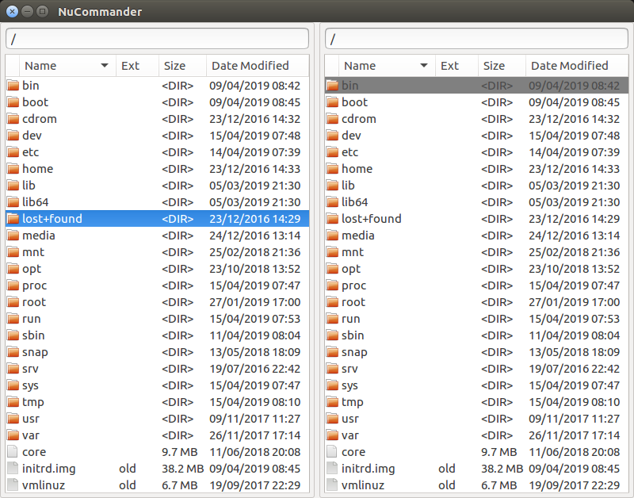
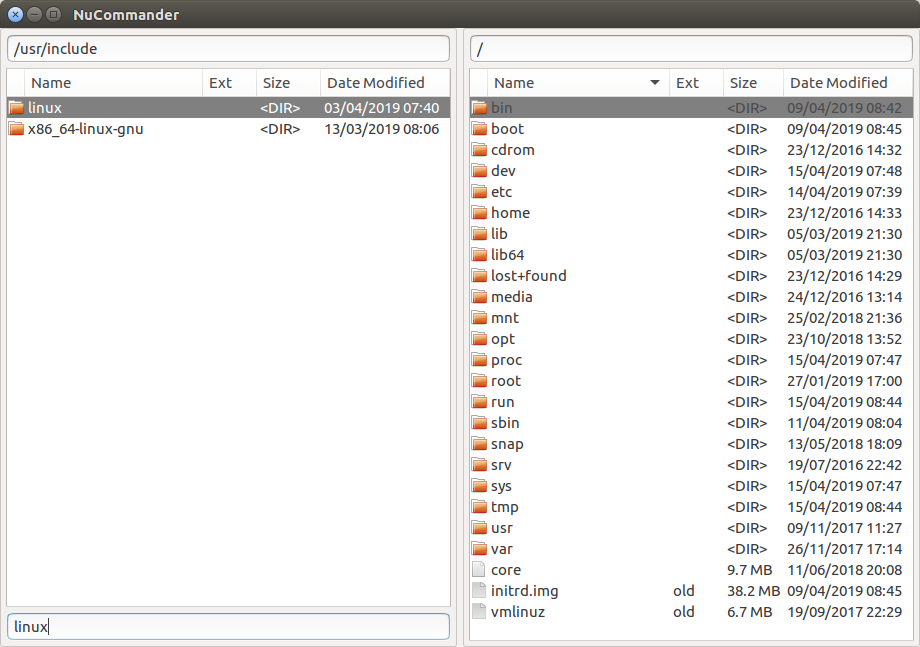
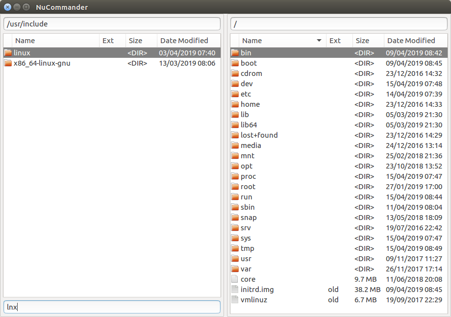

# NuCommander

NuCommander aims to be a fast, small orthodox file manager for Linux
with an emphasis on a keyboard driven user interface.

## Design

The twin pane interface, of Norton Commander, is preserved however all
redundant UI elements, such as command buttons and toolbars are
removed in favour of a clean, minimal user interface.

## Features

NuCommander has the basic features expected in an orthodox file
manager:

   * **Browsing Directories** - Both regular directories and archives.
   * **Basic Commands** - File copying, moving, renaming and deleting.
   * **Opening Files** - In their default applications.
   * **Archive Plugin Interface** - For creating plugins to read new archive types.

### Fuzzy Filtering

The file listing can be filtered using a fuzzy search. This allows you
to display only files which match a particular search string, whether
the search string matches in the beginning or the middle of the file
name. For example the search string "linux" will match the file names
"**linux**" as well as "x86_64-**linux**-gnu"

File names which contain disjoint occurrences of the characters in the
search string, in the same order, will also be matched. For example
the search string "lnx" will match "**l**i**n**u**x**, as well as any
other file name which contains an "l" an "n" and an "x", in that
order, separated by any number of characters.

## Status

Releases of NuCommander are available however it is still at
alpha-level thus it may contain bugs and some important features are
yet to be implemented.
